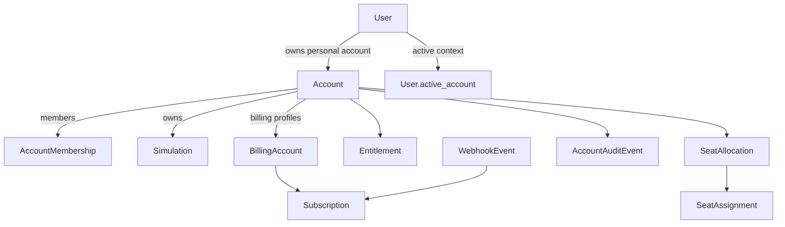

# Accounts, Billing, and Entitlements Foundation

This document describes the v1 commercial foundation for MedSim account ownership, billing ingestion, and runtime authorization.

## Goals

- Every user has a personal account.
- Simulations are owned by an account, not directly by a user.
- Effective entitlements are computed in MedSim, not fetched from Stripe or Apple at runtime.
- Personal and organization access can coexist without merging data ownership.
- Personal history stays with the user when they join or leave an organization.

## Model relationships

## Ownership rules

- Personal accounts use `Account.account_type = personal` and `owner_user`.
- Organization accounts use `account_type = organization` and can point at `parent_account`.
- `Simulation.account` is the canonical owner.
- `Simulation.user` and `chatlab.Message.sender` are attribution fields only and now use `SET_NULL` so org-owned history survives user removal.
- Web and API reads resolve account context with `X-Account-UUID`, then `User.active_account`, then the user’s personal account.

## Membership and permissions

- `AccountMembership` supports `billing_admin`, `org_admin`, `instructor`, and `general_user`.
- Personal accounts are system-managed through `owner_user` plus an active owner membership.
- Permission helpers live in `apps.accounts.permissions`.
- `org_admin` can manage members and see org-wide runs.
- `billing_admin` can manage billing but does not automatically get org-wide simulation visibility.
- `instructor` can see org-wide runs and use TrainerLab instructor tools.
- `general_user` is limited to their own simulations in the current account.

## Billing model

- `BillingAccount` stores provider-facing billing identity.
- `Subscription` stores normalized subscription state for Stripe, Apple, manual, or internal grants.
- `WebhookEvent` stores durable inbound Stripe and Apple processing records.
- Provider payloads are stored for audit/debug only.
- Runtime permission checks never call Stripe or Apple APIs.

## Entitlement model

- `Entitlement` is the runtime artifact used for authorization.
- First-pass billing access now supports base product grants only.
- `source_type` plus `source_ref` provides idempotent provenance.
- `scope_type = account` grants access to an account context.
- `scope_type = user` grants personal access to a specific user.
- `portable_across_accounts = true` allows personal user-scoped grants to follow the user into another active account context.
- `product_code` is internal-only and must be one of the canonical catalog codes.

## Effective entitlement resolution

`apps.billing.services.entitlements` computes effective access with union semantics:

- active entitlements in the current account
- portable personal user entitlements from the user’s personal account
- active subscription-derived grants
- manual grants
- seat assignment checks when seat allocations exist for seat-gated products
- one automatic seat for the owning user in a personal account

Rules:

- current account context is always respected
- org membership loss removes org-scoped access only
- end-of-period cancellations remain active through `current_period_end`
- provider APIs are not consulted during normal authorization

## Product catalog

`apps.billing.catalog` is the source of truth for:

- canonical internal product codes
- display names
- seat-gated flags
- Apple product ID mappings
- Stripe plan or price mappings

See [billing-product-catalog.md](./billing-product-catalog.md) for the active mapping and manual grant rules.

## Stripe flow

Web Stripe subscriptions are implemented for personal accounts only. The MVP products are
ChatLab Go, TrainerLab Go, and MedSim One, sold monthly with a 14-day trial and optional
first-period promotion configured in Stripe and referenced by env.

Checkout flow:

1. A signed-in web user posts an internal `product_code` to
   `/api/v1/billing/stripe/checkout-session/`.
2. MedSim ignores active organization context and resolves the user’s personal account.
3. MedSim resolves `product_code:monthly` to a Stripe price ID from
   `BILLING_STRIPE_PRICE_PLAN_MAP`; clients never submit Stripe price IDs.
4. MedSim blocks checkout when the personal account already has an active, trialing,
   past-due-with-access, or end-of-period-canceled subscription.
5. Stripe Checkout creates the subscription and Stripe webhooks remain authoritative for
   local `Subscription` and `Entitlement` state.

Customer Portal handles payment method updates, cancellations, invoices, and allowed plan
changes. The Stripe Dashboard portal configuration must be limited to ChatLab Go,
TrainerLab Go, and MedSim One; no organization products, quantity changes, or annual plans.

Stripe Dashboard checklist:

- Create monthly Checkout products/prices for `chatlab_go`, `trainerlab_go`, and `medsim_one`.
- Configure `BILLING_STRIPE_PRICE_PLAN_MAP` with only those three monthly price IDs.
- Configure Customer Portal to allow plan changes only among those monthly prices.
- Disable annual prices, organization/enterprise products, quantity changes, and promo code entry.
- Configure the promotional first-three-month discount as a coupon and expose only its coupon ID
  through `BILLING_STRIPE_PROMO_COUPON_ID`.

Webhook ingestion:

1. Stripe posts a signed webhook to `/api/v1/billing/stripe/webhook/`.
2. MedSim verifies the signature.
3. The payload is logged in `billing.WebhookEvent`.
4. The account is resolved from `metadata.account_uuid` or an existing Stripe billing profile.
5. MedSim upserts `BillingAccount` and `Subscription`, keeping the Stripe price code on `Subscription.plan_code`.
6. Subscription reconciliation maps that provider code to a canonical internal `product_code` and updates `Entitlement` rows.

Supported v1 lifecycle events:

- `checkout.session.completed`
- `customer.subscription.created`
- `customer.subscription.updated`
- `customer.subscription.deleted`
- `invoice.payment_failed`
- `invoice.payment_succeeded`

## Apple flow

1. The signed-in iOS user posts normalized transaction data to `/api/v1/billing/apple/sync/`.
2. MedSim always applies Apple subscriptions to that user’s personal account.
3. The transaction is logged in `billing.WebhookEvent`.
4. MedSim upserts the Apple `Subscription` by `original_transaction_id`, keeping the Apple product ID on `Subscription.plan_code`.
5. Subscription reconciliation maps that provider code to a canonical internal `product_code` and updates `Entitlement` rows.

Notes:

- Apple is personal-only in v1.
- Restores are safe because `original_transaction_id` is the durable subscription lineage key.
- App Store server notifications are deferred, but the provider boundary and webhook log already support adding them later.

## Legacy migration behavior

Schema migrations:

- add account, membership, audit, billing, subscription, entitlement, seat, and webhook tables
- add `User.active_account`
- add `Simulation.account`
- make attribution-only user FKs nullable where needed

Data migrations:

- create a personal account and active owner membership for every existing user
- set `User.active_account` to the personal account when unset
- backfill `Simulation.account` from the simulation creator’s personal account
- convert active legacy `LabMembership` rows into portable personal entitlements

Safety notes:

- data migrations run with `atomic = False` and batch iteration
- schema and data changes are split so environments can roll forward safely
- `Simulation.account` remains nullable during rollout for migration safety, but application code now treats account ownership as canonical

## Admin and support runbook

Django admin now supports:

- accounts
- account memberships
- account audit events
- billing accounts
- subscriptions
- entitlements
- seat allocations and assignments
- inbound webhook events

Operational actions:

- replay failed webhook events from `WebhookEvent`
- manually comp or revoke entitlements from `Entitlement`
- inspect simulation ownership from `Simulation.account`

Recommended support workflow for failed billing sync:

1. Open the `WebhookEvent` row and confirm provider payload and error.
2. Fix mapping or account resolution if needed.
3. Replay the event from admin.
4. Confirm `Subscription` and `Entitlement` rows updated as expected.

## Deferred items

- self-serve organization checkout
- enterprise/team checkout
- invoicing and PO workflows
- Apple server notification verification
- SSO/SAML and SCIM
- domain-based auto-join
- usage overage billing
- polished admin UX beyond Django admin
- duplicate pending checkout-session suppression beyond the local active-subscription block
